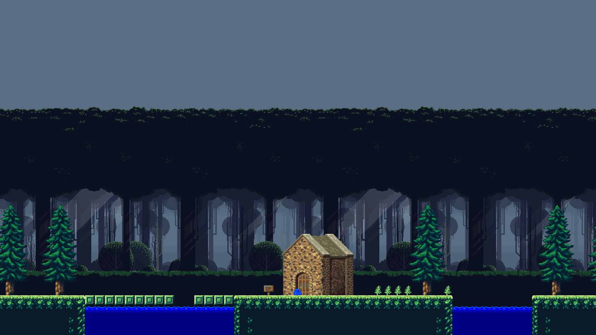

# Приключения Слизня

## Зависимости
* **SDL2**
* **SDL2_Image**
* **SDL2_Mixer**
* **SDL2_TTF**
## Заимствованные материалы
* [Музыка из SuperTux](https://github.com/SuperTux/supertux)
* [Анимированный лесоруб](https://andrwood.itch.io/warrior)
* [Анимированный стрелок (прим: был перекрашен в цвет живого автором проекта)](https://opengameart.org/content/death-soldier-32x32)
* [Анимированный скелет](https://opengameart.org/content/animated-skeleton)
* [Голем](https://opengameart.org/content/golem)
* [Фон](https://edermunizz.itch.io/free-pixel-art-forest)
* [Текстуры земли, деревья, дома, ящики и другое](https://vnitti.itch.io/taiga-asset-pack)
* [Шрифт](https://fonts-online.ru/fonts/bitter-pro)
* [Анимированный слизень](https://pixelfranek.itch.io/slime)
* [Анимированная кислота (прим: была перекрашена в цвет воды автором проекта)](https://lil-cthulhu.itch.io/tilebale-animated-acid)
* [Шипы](https://omniclause.itch.io/spikes)